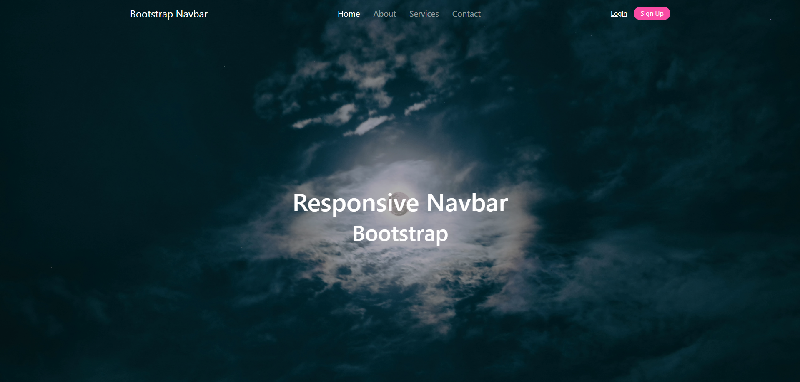

# Uma Página com Navbar responsiva utilizando Bootstrap

 
 - Página responsiva com Navbar e sidebar utilizando Booststrap

 - Projeto construído durante o curso PROPROFISSÃO.

## Acesso
 [Clique aqui para acessar! :)](https://github.com/GuilhermeSK2/Bootstrap-Responsive-Navbar)

## Tecnologias

- HTML
- CSS
- Bootstrap
- Git e Github

## Contato
[(LinkedIn)](https://www.linkedin.com/in/guilherme-freitas-9901a220b/)
-----
guilhermefsantos150@gmail.com
